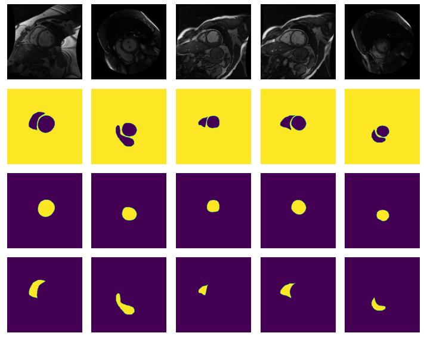

# Heart ventricle segmentation

## Left and right ventricle segmentation of Cardiac MRI

This repository shows the performance of a Pretrained U-NET applied to cardiac MRI slices.

1. Colab version in [file](colab/UNET_pretrained_multiclass-Git.ipynb)
2. .py version

