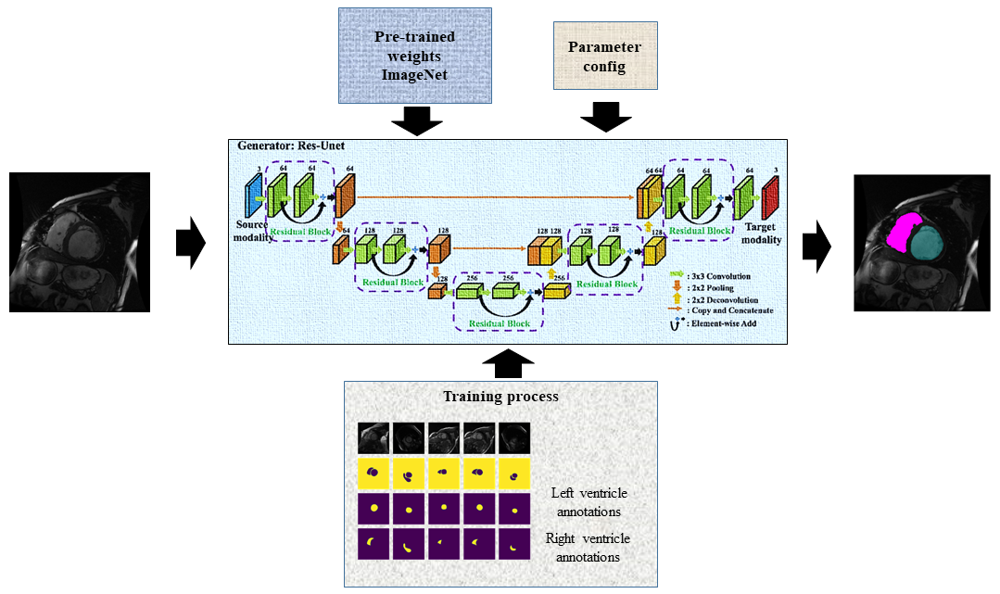
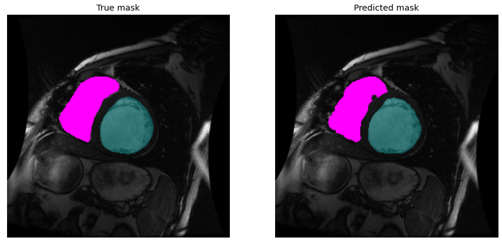
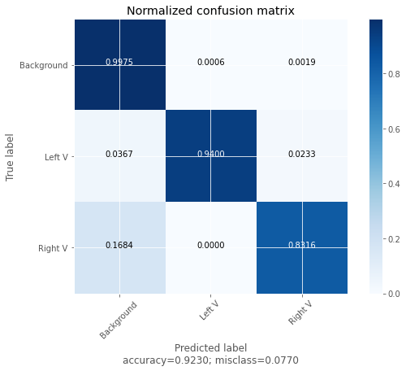

# Heart ventricle segmentation

## Left and right ventricle segmentation of Cardiac MRI

This repository shows the performance of a Pretrained U-NET applied to cardiac MRI slices.

1. Colab version in [Colab file](colab/UNET_pretrained_multiclass-Git.ipynb)
2. Python version built in [py file](py_version)

This work is an updated version of the project partially published at:

1. [Erik Carbajal-Degante, Steve Avendaño, Leonardo Ledesma, Jimena Olveres, Boris Escalante-Ramírez, "Active contours for multi-region segmentation with a convolutional neural network initialization," Proc. SPIE 11353, Optics, Photonics and Digital Technologies for Imaging Applications VI, 1135307 (1 April 2020)](https://doi.org/10.1117/12.2556928)
